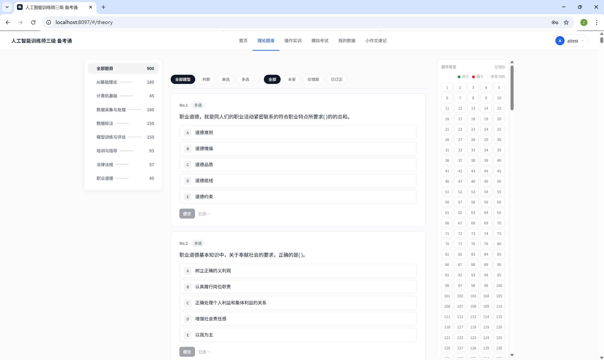
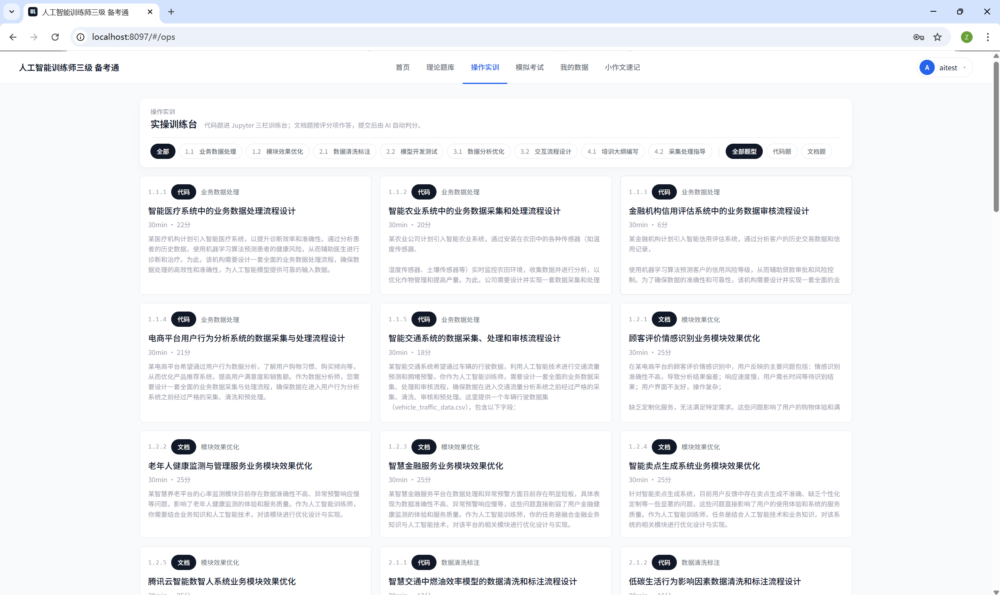
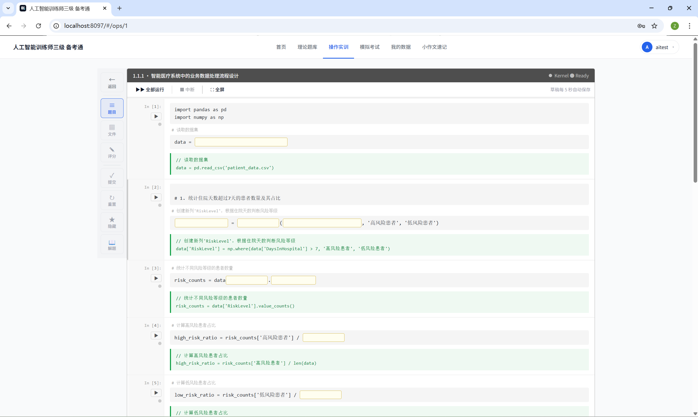
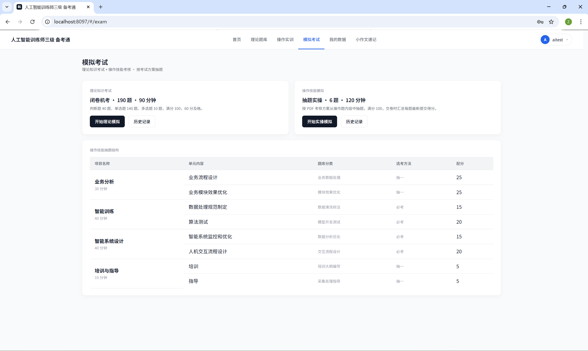

# 我做了个《人工智能训练师三级》考试系统

两天时间，做了个《人工智能训练师三级》备考练习系统。

900 道理论题、40 道操作题、模拟考试、错题复盘、本地账号和进度记录，全部跑在浏览器里，Docker Compose 一行起来。

身边不少同事朋友都在备考这门，卡住的从来不是某一道题，而是题库、附件、Notebook、进度，全散在七八个地方。每次打开备考都得先理一遍："上次做到哪？错题在哪？操作题数据集解压到哪个目录了？" 还没开始练，半小时就过去了。

我想要的就一件事：打开浏览器，登录本地账号，刷题刷题、操作练操作，记录自动留着。



## 操作题：和考试一样的手感

操作题是我自己最满意的一块。

40 道题，20 道代码题、20 道文档题，按业务数据处理、数据清洗标注、模型开发测试、数据分析优化、交互流程设计、培训大纲编写这些方向分。



代码题直接在服务器里跑代码。界面是 Jupyter Notebook 的手感：左边题干和评分点，中间代码单元，右边参考指引和解析，附件在同一个工作区里就能取。



CSV、XLSX、DOCX、图片、ONNX 模型，需要哪个直接点开，不用回到桌面找文件夹。

这点对备考很关键：平时怎么练，考试就怎么做，手感不会突然换一套。

## 理论题：知道哪里没掌握

理论题库 900 道，覆盖人工智能基础理论、数据采集与处理、数据标注、模型训练与评估、培训与指导、法律法规、职业道德、计算机基础。

可以按知识模块筛，也可以按判断、单选、多选筛。错题自动汇总，单独拉出来复盘。

刷题真正有用的地方，不是"我今天做了多少道"，而是"我到底还有哪些地方没掌握"。

## 模拟考 + 怎么跑起来

理论模拟按闭卷机考节奏抽题，实操模拟按操作技能考核方案走，提前熟悉时间压力、题目切换、交卷流程。平时慢慢补，考前用模拟考拉一遍节奏，心里会稳很多。



项目已经开源：

```text
https://github.com/zizhongxiao-svg/ai-trainer-level3-lab
```

会 Docker 的同学三行就能起来：

```bash
git clone https://github.com/zizhongxiao-svg/ai-trainer-level3-lab.git
cd ai-trainer-level3-lab
docker compose up --build
```

浏览器打开 `http://localhost:8097` 就行。

不想折腾环境，留言或者私信我要 Docker 安装包，一键起来。

## 写在最后

这个系统不复杂，但它把《人工智能训练师三级》备考里最容易打断人的事情——找题、找附件、配环境、记进度——一把收住了。

**真正舒服的备考工具，不一定要很炫，但要让你能连续练下去。**
